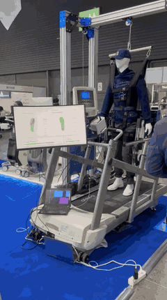
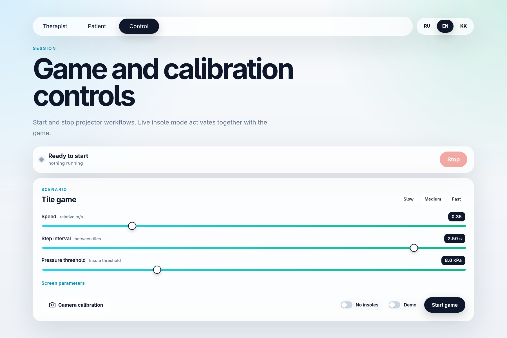

# Gressus — Gait Feedback System

<table>
<tr>
<td width="58%" valign="top">

**Gressus** (from the Latin for *"step"* or *"progress"*) is the visual feedback module of **A-GEAR**, a gait exoskeleton-assisted rehabilitation system for children with cerebral palsy. A projector guides steps on the treadmill; a depth camera and Insolex insoles confirm each footfall in real time.

The prototype uses RealSense depth, AprilTag camera–projector calibration, and optional insole pressure (Insolex/WaveX). Demonstrated at **KIHE-2026 — Kazakhstan International Healthcare Exhibition**, Almaty, 20–22 May 2026.

</td>
<td width="42%" valign="top" align="right">



</td>
</tr>
</table>

## 1. About the project

The child walks on the treadmill and steps on falling tiles (left/right lane). A hit counts only when three signals agree inside the tile zone: **depth** lift above the floor, **occlusion** of projected light by the foot, and **pressure** on the matching Insolex insole (`D AND R AND P`). The goal is rhythmic alternating load and clear feedback without a complex UI.

**Workflow:** depth (aligned-to-color), calibration in `config/calibration.json`, game logic in `scripts/tile_game.py`. In normal use the therapist starts sessions from the web GUI (see below); the same scripts can also be run from the terminal.

<p align="center">
  
</p>

## 2. Web GUI

The web app (`frontend/`) is the primary operator interface:

- **Therapist** — live insole pressure heatmaps (left/right foot).
- **Control** — start/stop the tile game and AprilTag calibration, speed and threshold sliders, demo and no-insole modes.
- **Patient** — simplified view for the session.

The FastAPI backend (`src/insole_pressure_web.py`) receives Insolex/WaveX frames over TCP JSONL on `0.0.0.0:9100`, streams them to the frontend over WebSocket, and spawns game/calibration processes on demand.

<p align="center">
  
</p>

### Setup and launch

**Backend** — Python dependencies:

```bash
poetry install
```

**Frontend** — requires [Deno](https://docs.deno.com/runtime/getting_started/installation/) (npm deps are resolved from `frontend/deno.lock` on first run):

```bash
curl -fsSL https://deno.land/install.sh | sh   # Linux/macOS; see Deno docs for other platforms
```

Start the backend:

```bash
poetry run uvicorn src.insole_pressure_web:app --host 0.0.0.0 --port 8000
```

In a separate terminal, start the frontend:

```bash
cd frontend
deno task dev
```

Open `http://localhost:5173`. Use the **Control** tab to start the game; live insole data appears on **Therapist** once a session is running.

## 3. Terminal launch

For debugging or setups without the web UI, run scripts directly.

### Calibration (AprilTag on the projector)

Via RealSense color stream (no manual `/dev/videoN`):

```bash
poetry run python scripts/calibrate_apriltag.py \
  -c realsense \
  --width 640 \
  --height 480 \
  --fps 30 \
  --display 0 \
  --tag-size 280 \
  --margin 30 \
  -o config/calibration.json
```

Enter — save, Esc — quit, `S` — snapshot `calibrate_debug.jpg` (listed in `.gitignore`).

### RealSense debug (no projector)

```bash
# color + depth, FPS, USB
poetry run python scripts/realsense_depth_preview.py --align-to-color
```

### Tile game (`tile_game.py`)

Two lanes; a hit requires **D AND R AND P** inside the tile zone:

1. **D** — depth pixels lifted **40–250 mm** above the baseline floor.
2. **R** — pixels not lit by the projector (foot occlusion).
3. **P** — insole pressure above `--insole-thresh-kpa`.

```bash
QT_QPA_PLATFORM=xcb poetry run python scripts/tile_game.py \
  --calibration config/calibration.json \
  -d 0 \
  --output-rotation 270 \
  --insole-port 9100 \
  --insole-thresh-kpa 8 \
  --speed 0.35 \
  --step-time-s 1.2
```

**Speed:** `-S` / `--speed` / `--treadmill-speed-mps` — **0.05–1.5** (nominal m/s); in px/s: `speed × 420`, range ~45–620. To speed up, first lower `--step-time-s`, then raise `--speed` to ~1.0–1.5.

**Projection offset:** arrow keys (Shift = ×5), then `S` — writes `hit_shift_canvas` to the same JSON.

Without insoles: `--no-insole`.

**Session flow:** stand outside the projection zone → `SPACE` (floor baseline + start) → step on tiles alternately → `R` reset, `Esc`/`Q` quit.

Flags: `--calibration`, `-d/--display`, `--output-rotation`, `--no-insole`, `--insole-port`, `--insole-thresh-kpa`, `-S/--speed/--treadmill-speed-mps`, `--step-time-s`.

**Resolution:** JSON fields `camera_resolution`, `proj_resolution`; run the game on the same display (`-d`) and projector resolution as during calibration; camera — 640×480.

## 4. Documentation

| Document                                                           | Description                                   |
| ------------------------------------------------------------------ | --------------------------------------------- |
| [docs/occlusion-and-treadmill.md](docs/occlusion-and-treadmill.md) | Shadow, occlusion, why depth, lighting, setup |
| [docs/system-spec.md](docs/system-spec.md)                         | Hardware, D435 pipeline, checklist            |
| [docs/roadmap.md](docs/roadmap.md)                                 | Development vectors, priorities, 3–6 month plan |
