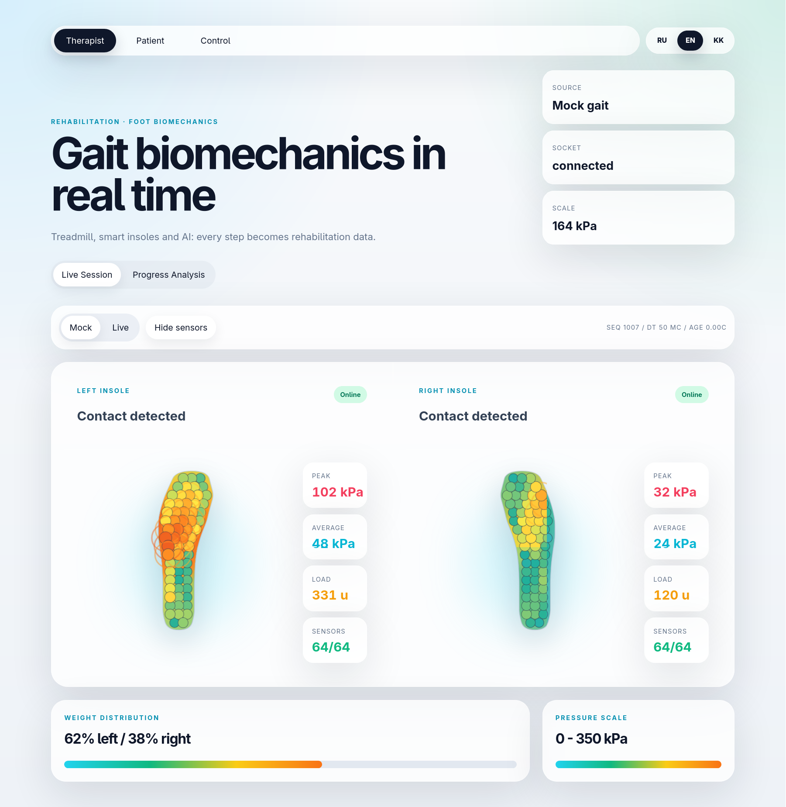

# Gressus — Gait Feedback System

<table>
<tr>
<td width="58%" valign="top">

**Gressus** (from the Latin for *"step"* or *"progress"*) is the visual feedback module of **A-GEAR**, a gait exoskeleton-assisted rehabilitation system for children with cerebral palsy. A projector guides steps on the treadmill; a depth camera and Insolex insoles confirm each footfall in real time.

The prototype uses RealSense depth, AprilTag camera–projector calibration, and optional insole pressure (Insolex/WaveX). Demonstrated at **KIHE-2026 — Kazakhstan International Healthcare Exhibition**, Almaty, 20–22 May 2026.

</td>
<td width="42%" valign="top" align="right">


</td>
</tr>
</table>

## 1. About the project

The child walks on the treadmill and steps on falling tiles (left/right lane). A hit counts only when three signals agree inside the tile zone: **depth** lift above the floor, **occlusion** of projected light by the foot, and **pressure** on the matching Insolex insole (`D AND R AND P`). The goal is rhythmic alternating load and clear feedback without a complex UI.

**Workflow:** depth (aligned-to-color), calibration in `config/calibration.json`, game loop in `ros2_ws/src/gressus_game/` started via `ros2 run gressus_game tile_game_node`. The therapist normally starts sessions from the web GUI.

<p align="center">
  
</p>

## 2. Web GUI

The web app (`frontend/`) is the primary operator interface:

- **Therapist** — live insole pressure heatmaps (left/right foot).
- **Control** — start/stop the tile game and AprilTag calibration, speed and threshold sliders, demo and no-insole modes.
- **Patient** — simplified view for the session.

The FastAPI backend (`backend/`) serves geometry and runtime control. Live insole pressure is streamed by `insole_bridge_node` over WebSocket (`ws://127.0.0.1:8765/ws/insole`) and ROS topic `/insole/pressure`. TCP ingest from Insolex/WaveX runs in the same node on `0.0.0.0:9100`. Demo gait without hardware uses client-side mock pressure in the frontend; game code lives in the ROS package `gressus_game`.

<p align="center">
  
</p>

### Setup and launch

All services use `network_mode: host` (shared localhost for API `:8000`, Vite `:5173`, insole WS `:8765`).

```bash
docker compose up -d --build
```

| Service | URL / role |
|---------|------------|
| `frontend` | http://localhost:5173 |
| `backend` | http://localhost:8000/api/health |
| `ros2` | ROS nodes, RealSense, insole bridge |

Set `IS_DEBUG=false` in compose for Vite preview (frontend). Backend always runs uvicorn.

Interactive ROS shell:

```bash
docker compose exec ros2 bash
```

## 3. ROS 2 runtime

The ROS container entrypoint builds the workspace and starts `session_manager` on `http://127.0.0.1:9090`. Interactive shells (`docker compose exec ros2 bash`) auto-source ROS via `/root/.bashrc`.

### Launch files (`gressus_bringup`)

```bash
docker compose exec ros2 bash

# individual stacks
ros2 launch gressus_bringup insole.launch.py
ros2 launch gressus_bringup camera.launch.py
ros2 launch gressus_bringup game.launch.py
ros2 launch gressus_bringup game_camera.launch.py
ros2 launch gressus_bringup calibrate.launch.py

# full session: insole + camera + game
ros2 launch gressus_bringup session.launch.py speed:=0.35 step_time_s:=2.5
```

Manual node runs (same as before):

```bash
ros2 run gressus_insole insole_bridge_node
ros2 run gressus_realsense realsense_node
ros2 run gressus_game tile_game_node
```

Game and calibration read/write `config/calibration.json` at the repo root (`/gressus/config/…` in Docker).

The web **Control** panel calls `POST /api/runtime/start` → backend → `session_manager` → launch by mode:

| UI flags | Launch |
|----------|--------|
| Demo | `game.launch.py` only |
| No insoles | `game_camera.launch.py` (camera + game) |
| neither | `session.launch.py` (insole + camera + game) |

### Calibration (AprilTag)

Project defaults (RealSense D435, same as the web **Control** panel and `backend/modules/runtime/service.py`):

```bash
ros2 launch gressus_bringup calibrate.launch.py output_rotation:=270
```

> ⚠️ `output_rotation` **must** match what the game uses. The homography saved in
> `config/calibration.json` is canvas→camera and includes that rotation. If you
> change the rotation later, re-run calibration — otherwise the game refuses to
> start with a canvas-size mismatch error.

Bare run without `--` flags:

```bash
ros2 run gressus_calibration calibrate_apriltag
```

…uses the node's argparse defaults (`--camera 0`, `1920×1080`, auto display, tag size from screen, `--output-rotation 270`) — **not** the RealSense setup above. Prefer the explicit command for the treadmill rig.

List all calibration flags: `ros2 run gressus_calibration calibrate_apriltag -- --help`.

**Controls:** align four AprilTags on the projector → `Enter` save to `config/calibration.json`, `Esc` quit, `S` snapshot JPG.

### Tile game

Project defaults (live insole + camera topics; matches Control UI defaults):

```bash
ros2 launch gressus_bringup game.launch.py \
  output_rotation:=270 \
  insole_thresh_kpa:=8 \
  speed:=0.35 \
  step_time_s:=2.5
```

Equivalent bare node run:

```bash
ros2 run gressus_game tile_game_node -- \
  --output-rotation 270 --insole-thresh-kpa 8 --speed 0.35 --step-time-s 2.5
```

Two lanes; a hit requires **D AND R AND P**:

1. **D** — depth pixels lifted above the baseline floor.
2. **R** — pixels not lit by the projector (foot occlusion).
3. **P** — insole pressure above `--insole-thresh-kpa` from `/insole/pressure`.

`--demo` — no camera topics (auto-press). `--no-insole` — skip pressure gate. Launch: `demo:=true`, `no_insole:=true`.

**Session flow:** stand outside the projection zone → `SPACE` (floor baseline + start) → step on tiles alternately → `R` reset, `Esc`/`Q` quit.

## 4. Documentation

| Document                                                           | Description                                   |
| ------------------------------------------------------------------ | --------------------------------------------- |
| [docs/BACKEND.md](docs/BACKEND.md)                                 | FastAPI layout: modules, services, app_state  |
| [docs/occlusion-and-treadmill.md](docs/occlusion-and-treadmill.md) | Shadow, occlusion, why depth, lighting, setup |
| [docs/system-spec.md](docs/system-spec.md)                         | Hardware, D435 pipeline, checklist            |
| [docs/roadmap.md](docs/roadmap.md)                                 | Development vectors, priorities, 3–6 month plan |
